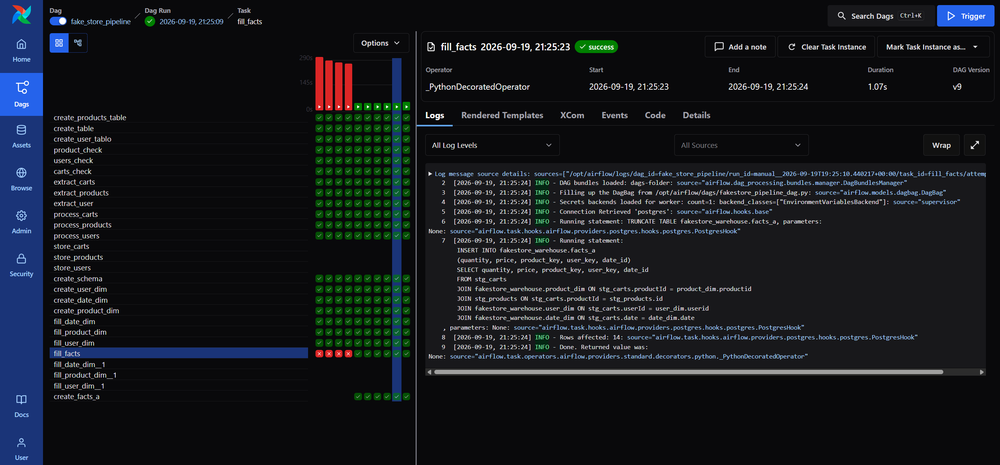

# Fake Store Data Engineering Pipeline

An end-to-end batch data engineering project that extracts product, user and cart data from the Fake Store API, transforms nested JSON data with Python, and loads it into a PostgreSQL dimensional warehouse.

Apache Airflow orchestrates the complete workflow, including API availability checks, table creation, extraction, transformation, staging loads, dimension loads and fact-table loading.

## Pipeline Overview

Fake Store API → Airflow API checks → Python transformations → PostgreSQL staging tables → dimension tables → fact table

## What I Built

* Built a single end-to-end Apache Airflow DAG for the complete ETL workflow
* Added API availability checks before starting extraction tasks
* Extracted data from the Products, Users and Carts API endpoints
* Configured request timeouts and Airflow retry behavior for temporary API failures
* Processed API JSON responses using Python data structures
* Flattened nested user, address and cart-product structures
* Loaded cleaned data into PostgreSQL staging tables
* Created a dedicated warehouse schema
* Built product, user and date dimension tables
* Created surrogate keys for warehouse dimensions
* Joined staging data with dimension tables
* Loaded quantity, price and dimension keys into the `facts_a` table
* Filtered duplicate product and user records using their IDs
* Filtered duplicate cart lines using the `cart_id + product_id` combination
* Filtered records containing null values before staging loads

## Current Loading Strategy

The current Airflow V1 uses a full-refresh loading strategy. Staging, dimension and fact tables are cleared and rebuilt during each successful DAG run.

Because the tables are rebuilt instead of continuously appended, repeated successful runs do not accumulate duplicate fact rows. However, the `TRUNCATE` and `INSERT` operations still need to be executed inside a single database transaction to guarantee rollback if a load fails.

The original local/Jupyter implementation included a `water_mark` table and incremental loading based on:

```sql
WHERE date > watermark
```

Watermark-based incremental loading has not yet been migrated into the current Airflow DAG. It is planned for V2 after transaction handling and additional data-quality controls are completed.

## Data Warehouse Schema

The warehouse follows a dimensional model containing product, user and date dimensions connected to the `facts_a` table.

The `water_mark` table visible in the diagram belongs to the original local incremental-loading implementation. The current Airflow V1 follows the full-refresh strategy described above.


## Airflow DAG Execution

The screenshot below shows a successful end-to-end DAG run. Airflow completed the API checks, extraction, transformation, staging, dimension loading and fact-table loading. The final `fill_facts` task successfully loaded 14 rows into PostgreSQL.



## How to Run

### Prerequisites

* Docker
* Docker Compose
* Git

### 1. Clone the repository

```bash
git clone https://github.com/barissonmez-data/fakestore-data-engineering-pipeline.git
cd fakestore-data-engineering-pipeline
```

### 2. Start the services

```bash
docker compose up --build -d
```

### 3. Check the running services and ports

```bash
docker compose ps
```

Open the Airflow web interface using the host port shown for the Airflow service.

### 4. Verify the PostgreSQL connection

Before triggering the DAG, confirm that Airflow contains a database connection with the connection ID `postgres`.

### 5. Run the pipeline

Enable and trigger the `fake_store_pipeline` DAG from the Airflow interface. Task progress and execution logs can be monitored directly from the DAG view.

### 6. Stop the services

```bash
docker compose down
```

## Next Steps

* Define the fact-table grain explicitly and retain `cart_id` as a degenerate dimension
* Add source-to-fact row-count reconciliation
* Detect and log rows lost because of missing dimension matches
* Add foreign-key integrity checks between the fact and dimension tables
* Execute `TRUNCATE + INSERT` operations inside a single transaction with rollback support
* Add structured logs for extracted, accepted, rejected and duplicate row counts
* Migrate watermark-based incremental loading into the Airflow DAG
* Add unit tests for transformation functions
* Add integration tests for warehouse loading
* Add audit and rejected-record tables
* Add Airflow failure notifications and alerting

## Tech Stack

* Python
* Apache Airflow
* PostgreSQL
* SQL
* requests
* Docker and Docker Compose
* pandas and Jupyter Notebook (original local implementation)
* Git and GitHub
