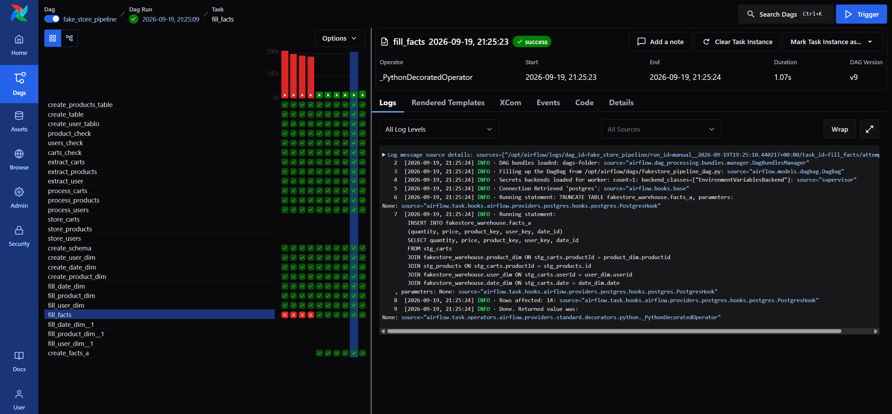

# Fake Store Data Engineering Pipeline

An end-to-end batch ETL pipeline that extracts product, user, and cart data from the Fake Store API, validates and transforms the data with Python, and loads it into a PostgreSQL dimensional warehouse.

Apache Airflow orchestrates the workflow, while Docker Compose runs Airflow and PostgreSQL as separate local services.

```text
Fake Store API → API Checks → Transform & Validate → Staging → Dimensions → Fact Table
```



---

## Main Features

- Extracts products, users, and carts from the Fake Store API
- Checks API availability before processing
- Flattens nested JSON structures
- Removes duplicate products and users by ID
- Removes duplicate cart lines using `cart_id + product_id`
- Rejects records containing null values
- Stores rejected records in `reject_table`
- Loads cleaned records into PostgreSQL staging tables
- Builds product, user, and date dimensions
- Loads the final fact table using surrogate keys
- Performs row-count reconciliation during staging and fact loading
- Uses retries, HTTP timeouts, execution timeouts, and logging
- Uses PostgreSQL transactions with rollback on failure
- Runs locally with Docker Compose

---

## Data Warehouse

The warehouse follows a dimensional model with product, user, and date dimensions connected to the `facts_a` table.


Main warehouse tables:

- `product_dim`
- `user_dim`
- `date_dim`
- `facts_a`

Staging tables:

- `stg_products`
- `stg_user`
- `stg_carts`

Rejected records are stored in `reject_table`.

The current Airflow implementation uses a **full-refresh strategy**. The `water_mark` table shown in the original schema belongs to an earlier local incremental-loading implementation.

---

## Reliability and Data Quality

### Transactional Loads

Each staging, dimension, and fact-table load runs inside its own PostgreSQL transaction.

```text
TRUNCATE → INSERT → VALIDATE → COMMIT
```

If an operation fails, the transaction is rolled back and the exception is raised again so Airflow can mark the task as failed.

This prevents failed refreshes from leaving an individual table partially updated.

### Reject Handling

Null and duplicate records are stored in `reject_table` instead of being silently discarded.

Each rejected record includes:

- record ID
- rejected record data
- rejection reason
- timestamp
- source

Reject handling is implemented for products, users, and cart lines.

### Row-Count Reconciliation

For staging loads, accepted records are compared with the rows actually loaded into PostgreSQL.

The fact-table load also compares staged cart lines with loaded fact rows.

A mismatch raises an exception and rolls back the current transaction.

### Full-Refresh Idempotency

The pipeline was executed repeatedly against the same source data.

Warehouse row counts remained stable between successful runs, confirming that the current full-refresh implementation does not continuously accumulate duplicate rows.

---

## Docker Setup

The project runs with two main Docker Compose services.

### Airflow

Airflow runs the ETL workflow and is built from the project `Dockerfile`.

The local `./dags` directory is bind-mounted into the container, allowing DAG changes without rebuilding the Airflow image.

The Airflow UI is available at `http://localhost:8082`.

### PostgreSQL

The warehouse runs in a separate PostgreSQL 16 container.

Data is stored in a named Docker volume and survives normal container recreation.

Airflow connects to PostgreSQL internally through `fakestore_db:5432`.

A `pg_isready` health check ensures PostgreSQL is ready before Airflow starts.

---

## Configuration

Database credentials are stored in a local `.env` file excluded from Git.

Required variables:

- `DB_USER`
- `DB_PASSWORD`
- `DB_NAME`

The variables are documented in `.env.example`.

The Airflow PostgreSQL connection is configured through `AIRFLOW_CONN_POSTGRES` in `compose.yml`, so no manual Airflow UI connection setup is required.

---

## Run Locally

### 1. Clone the repository

```bash
git clone https://github.com/barissonmez-data/fakestore-data-engineering-pipeline.git
cd fakestore-data-engineering-pipeline
```

### 2. Create the environment file

macOS / Linux:

```bash
cp .env.example .env
```

Windows PowerShell:

```powershell
Copy-Item .env.example .env
```

### 3. Start the services

```bash
docker compose up --build -d
```

Check their status:

```bash
docker compose ps
```

### 4. Open Airflow

Open `http://localhost:8082` and trigger:

`fake_store_pipeline`

### 5. Stop the services

```bash
docker compose down
```

PostgreSQL data remains in the named volume.

Avoid `docker compose down -v` unless you intentionally want to remove the database volume.

---

## Design Decisions

- **Separate Airflow and PostgreSQL services:** keeps orchestration and warehouse storage separate
- **Connection as code:** PostgreSQL connection is configured through Docker Compose
- **Named PostgreSQL volume:** warehouse data survives container recreation
- **Bind-mounted DAG directory:** DAG changes do not require an image rebuild
- **Transactional loads:** failed database loads are rolled back
- **Reject handling:** invalid records remain inspectable
- **Row-count validation:** potential silent data loss causes the load to fail

---

## Current V2 Progress

### Completed

- Transaction-based database loads
- Rollback on failure
- Error handling
- Row-count reconciliation
- Reject table and reject handling
- Operational logging
- Full-refresh idempotency validation

### Next

1. Audit / pipeline run table
2. Referential integrity and stronger data-quality checks
3. Incremental loading
4. Unit and integration tests
5. CI
6. Failure notifications

---

## Known Limitations

- Airflow currently runs in `standalone` mode for local development
- The Airflow pipeline currently uses full-refresh loading
- Historical run metrics are not yet stored in an audit table
- Referential-integrity checks are not yet fully implemented
- Automated tests and CI are not yet implemented
- Failure notifications are not yet implemented

---

## Tech Stack

- Python
- SQL
- Apache Airflow
- PostgreSQL 16
- Docker
- Docker Compose
- requests
- Git
- GitHub
